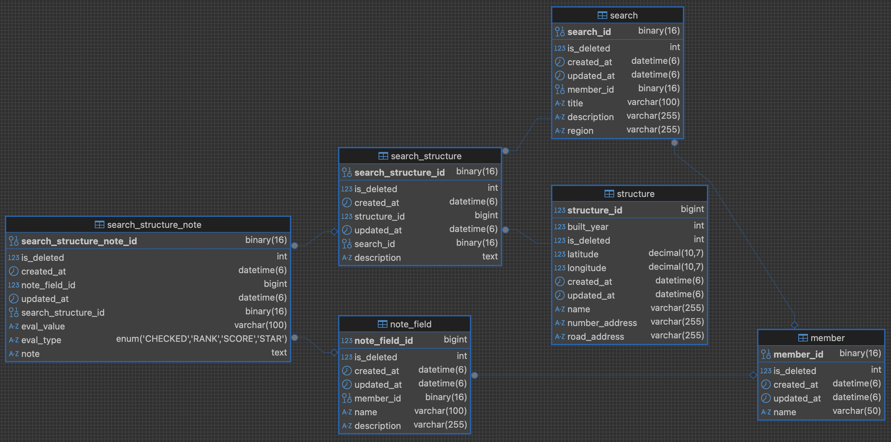

# ZibNote Backend 🏡📝
- 부동산 현장 방문(임장)을 기록하는 어플리케이션
- 사용자는 임장한 건물들을 자신이 커스텀한 기준별로 기록 및 평가하여 임장 내용을 관리할 수 있습니다.

## 기술 스택
- Spring Boot 3.4
- Java 17
- JPA
- H2, MySQL

## 스키마

[MySQL의 스키마 DDL](docs/database/mysql_ddl.sql)
- MEMBER: 회원
- STRUCTURE: 건물
- SEARCH: 임장
- SEARCH_STRUCTURE: 임장한 건물
- SEARCH_STRUCTURE_NOTE: 임장한 건물별 기록
- NOTE_FIELD: 기록 기준

## 주요 기능
- 임장 내용 CRD

## 아키텍처 구조
Hexagonal Architecture를 참고하여 외부 변경에 유연하게 대처할 수 있는 것을 목표로 구성했습니다.
- 구조
```
- adapter/
    - in/web/
        - (SomeDomain)/SomeController.java
    - out/persistence/
        - (SomeDomain)/SomePersistenceAdapter.java
- application/service/
    - (SomeDomain)/SomeService.java
- domain/
    - (SomeDomain)/
        - model/
            - Some.java
        - port/
            - in/SomeUseCase.java
            - out/SomeRepository.java
```
- 흐름
```
[adapter]  Controller >
[adapter]  Service 
[port]     (UseCase) >
[domain]   Model >
[port]     (Repository) 
[adapter]  PersistenceAdapter
```

## 실행 방법
### LOCAL
- 환경변수 전달 "SPRING_PROFILES_ACTIVE": "local"
- 프로젝트 실행
### DEFAULT
- MySQL 서버 설치 및 실행
    - MySQL 서버에서 [DDL](docs/database/mysql_ddl.sql) 실행 
    - 또는 application.yml에서 `hbm2ddl.auto: create`로 변경
- 환경변수 전달 "SPRING_PROFILES_ACTIVE": "default"
- 프로젝트 실행

## API
- [Swagger 사용](http://localhost:8080/swagger-ui.html)

## 고민했던 점
- [01. 스키마 구성시 고민점과 해결 방법](docs/develop/01_Schema.md)
- [02. JPA 사용 방법 변경 및 리팩토링](docs/develop/02_Refactoring_in_JPA.md)
- [03. 아키텍처 구성시 고민점 및 리팩토링](docs/develop/03_Refactoring_in_Architecture.md)
- [04. 로그인 인증 및 상태 유지 방식 변경 기록](docs/develop/04_Auth.md)
